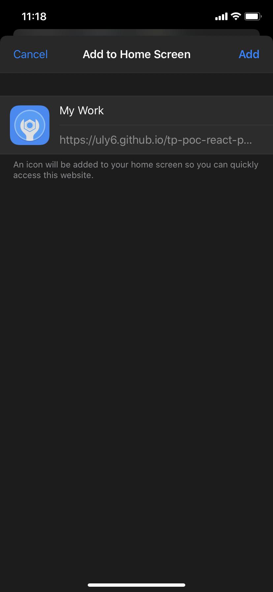
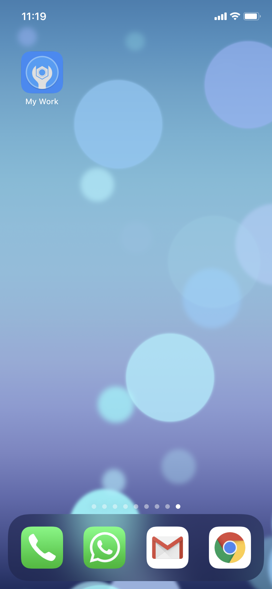
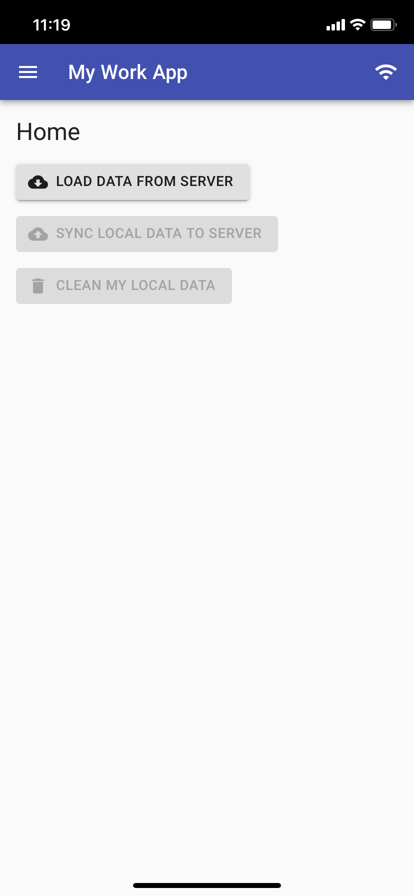
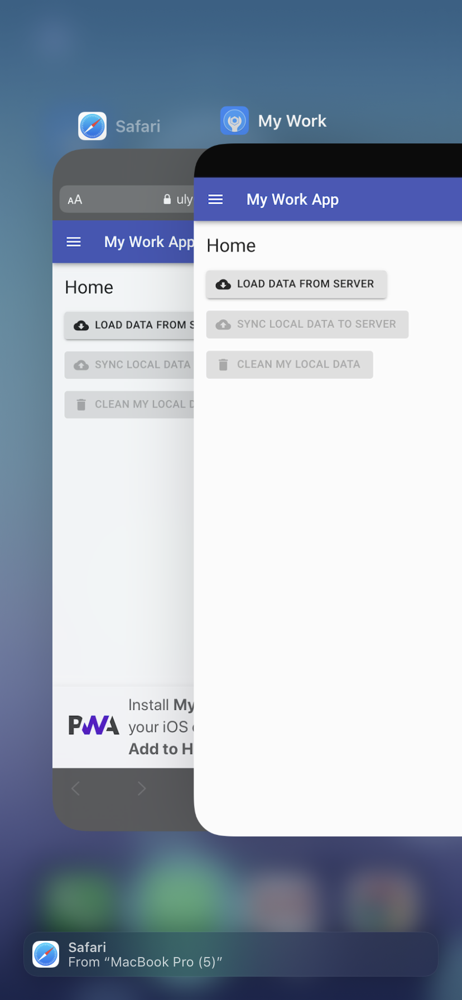

# PWA - Proof of Concept
___

## GOALS

Here are some of the goals for this POC:

- Offline First
- Take photos / videos
- Geolocation from photos
- Geolocation from device
- iOS support

## REQUIREMENTS

When online, the user clicks a button to load the data he needs to work.

After the data is loaded, the user could go offline and still be able to update data and attach photos or videos.

The app tries to retrieve geolocation info from the photo file or from the device's GPS.

When online, the user can click a button to sync back the updated information to the server.

The app should work mainly for iOS more specifically on iPads

## HOW THE APP WORKS

The user loads some work orders, each work order has a list of tasks, the user can set tasks as complete, remove and add new tasks. Other than that, the user can attach or take photos and videos directly in the app.

When the user attaches or takes a photo, the app tries to recover geolocation info from the EXIF tags in the photo, if the tags are not there the app asks for the current device location as a fallback.

After the work is done the user can sync the data back to the server and clean the local data.

Only the initial load of data and the sync of data back to the server needs the user to be online to perform, other than that the entire app works offline.

Below is a video showing how can we install the app to the home screen and the basic functionality of the app working when offline.

<video width="320" height="480" controls>
  <source src="./docs/videos/web_app_a2hs.mov" type="video/mp4">
</video>

## HOW THE APP WAS BUILT

We have 3 small projects working together to accomplish our goals for this POC: a REST API, a remote database, and the PWA web app itself.

### REST API Project

This is just a small REST API to load the initial data when the user load the work orders. The initial data loads could come directly from sync from a CouchDB to the local PouchDB, but just for the sake of this POC we are loading from a REST endpoint to show that it is possible as well.

### Remote database to sync

This is another small project just exposing the PouchDB-server remotely using express. The ideal is to use CouchDB to sync with the local PouchDB but because I didn't find any free CouchDB services available the option for the PouchDB-server would do the service.

## TECH STACK

PWA Web App:

- [React](https://reactjs.org/)
- [React Material-UI](https://material-ui.com/)
- [Workbox](https://developers.google.com/web/tools/workbox)
- [PouchDB](https://pouchdb.com/)
- [exif-js](https://github.com/exif-js/exif-js)
- [a2hs.js](https://github.com/koddr/a2hs.js)

REST API to load data:

- [NodeJS](https://nodejs.org/en/)
- [Express](https://expressjs.com/)

Remote database to sync:

- [PouchDB-server](https://github.com/pouchdb/pouchdb-server)

## FEATURES HIGHLIGHT

### SERVICE WORKER

A service worker is a script that the browser runs in the background, and even if you close the tab or the browser's window it is still running in the background. With service workers we can build offline support precaching the files we need, we could background sync our app with a server, and support push notifications.

This is a fun presentation about service workers and offline first by Jake Archibald who worked in the creation of these APIs.

[Building offline-first Progressive Web Apps - Google I/O 2016](https://www.youtube.com/watch?v=cmGr0RszHc8)

### OFFLINE FIRST

There are two types of cache we are using in this poc. The precaching of static content like CSS, javascript, images and icons, this type of cache makes possible to the user use the app when offline, and there is the cache of dynamic data loaded from the REST API as JSON and this is the data the user manipulates when interacting with the app.

#### PRECACHE STATIC CONTENT

To precache the static content we are using the new [Cache API](https://developer.mozilla.org/en-US/docs/Web/API/Cache) and the [Workbox](https://developers.google.com/web/tools/workbox) library.

If you want to have a better overview of the Cache API and the different cache strategies you can apply to your app, the links below are good start points.

[The Cache API: A quick guide](https://web.dev/cache-api-quick-guide/)

[The Offline Cookbook](https://developers.google.com/web/fundamentals/instant-and-offline/offline-cookbook)

We are using workbox to help us in the service worker registration and to precache our app-shell (static files).
Workbox has a lot feature including plugins to easily apply the cache strategy of choice, expire cache entries, limit number cache entries, intercept requests and return a different payload, etc.

In this POC we used the workbox-build to inject the files' names we want to precache. This is necessary because we are using create-react-app to build our react application and the build process creates randomized names for our files and splits the javascript files into multiple files to lazy load modules, so there is no way to predict the file names. What the workbox-build injectManifest does is it reads the files in the build folder, collects the files' names, and injects in another template file pre-defined by us.

[Workbox - injectManifest](https://developers.google.com/web/tools/workbox/modules/workbox-build)

[Workbox - Common Recipes](https://developers.google.com/web/tools/workbox/guides/common-recipes)

#### CACHE DYNAMIC CONTENT

It is recommended to store JSON data on IndexedDB, which has vast support and can store more data compared to LocalStorage and WebSQL. IndexedDB can store blob data and is async as well. The only problem with IndexedDB is the API is not that user friendly.

We decided to use PouchDB for 3 reasons:

- PouchDB has a more friendly/modern API

- PouchDB uses IndexedDB by default behind the scenes and if IndexedDB is not available it falls back to WebSQL and if WebSQL is not available to LocalStorage, so we have a nice fallback strategy here.

- PouchDB is always present in offline first articles especially because it has as main feature the ability to sync with CouchDB, and our POC needs to sync data back to the server so it worth a try.

### ADD TO HOME SCREEN

When we add the app to the home screen it works similarly as a native app, it has an icon, splash screen, and run in full screen without the browser address bar on top of navigation menu at the bottom.

#### MANIFEST AND META TAGS

The [manifest](https://developer.mozilla.org/en-US/docs/Web/Manifest) file is a standard way to define app name, short name, icons, background colors for the app when installed to the home screen.

[Here](https://web.dev/add-manifest/) is a nice tutorial explaining the manifest properties.

To help you in the task of creating a manifest file and creating different icons' sizes for different devices' needs, some websites that generate and resize the icons for you.

[Web App Manifest Generator](https://app-manifest.firebaseapp.com/)

[PWA Starter](https://pwastarter.love2dev.com/)

#### META TAGS

In addition to the manifest file, we have to add some Apple-specific meta tags in the index.html to define icons and colors for Apple devices.

[Safari - Supported Meta Tags](https://developer.apple.com/library/archive/documentation/AppleApplications/Reference/SafariHTMLRef/Articles/MetaTags.html)

[Safari - Configuring Web Applications](https://developer.apple.com/library/archive/documentation/AppleApplications/Reference/SafariWebContent/ConfiguringWebApplications/ConfiguringWebApplications.html)

#### A2HS JS

[a2hs.js](https://github.com/koddr/a2hs.js) is a helper library for iOS to indicate the user how to install the app when using mobile Safari. You can fully customize the logo and colors of the banner presented to the user at the bottom of the screen.

After you click in the banner it will not appear anymore, it keeps track of this state in the localStorage of the browser's device. to make it appear again you have to clean the browser's cache.

### APP UPDATE

Show a prompt indicating that there is a new version of the app and if the user would like to update.

<video width="320" height="480" controls>
  <source src="./docs/videos/web_app_update.mov" type="video/mp4">
</video>

### ONLINE / OFFLINE INDICATOR

Code that monitors if the user has or not connectivity and changes the icon accordingly.

We are using the [online/offline events](https://developer.mozilla.org/en-US/docs/Web/API/NavigatorOnLine/Online_and_offline_events) dispatched by the browser.

### CAPTURING IMAGE AND VIDEO

The video and image capture was pretty simple to build, here are two reference docs about how to accomplish this.

[Capturing images](https://developers.google.com/web/fundamentals/media/capturing-images)

[Recording videos](https://developers.google.com/web/fundamentals/media/recording-video)

## DEMO DEPLOYED ON GITHUB

[https://uly6.github.io/tp-poc-react-pwa/](https://uly6.github.io/tp-poc-react-pwa/)

[PouchDB-server Fauxton](https://tp-poc-pouchdb-server.herokuapp.com/_utils/)

## ISSUES FOUND

### Apple remove EXIF info when uploading from Safari mobile

Apple removes all the geolocation tags when you upload a photo to the web (share on social media, attach to email)

[https://apple.stackexchange.com/questions/326789/gps-exif-from-iphone-photo-upload-in-safari](https://apple.stackexchange.com/questions/326789/gps-exif-from-iphone-photo-upload-in-safari)

[https://stackoverflow.com/questions/57942150/file-upload-and-exif-in-mobile-safari](https://stackoverflow.com/questions/57942150/file-upload-and-exif-in-mobile-safari)

[https://www.flickr.com/help/forum/en-us/72157700799502582/](https://www.flickr.com/help/forum/en-us/72157700799502582/)

#### Work around

On iPhone camera settings ( Settings > Camera > Formats ) there are two possible formats `High Efficiency` and `Most Compatible`.

`High Efficiency` is selected by default.

##### High Efficiency selected

There is no GPS info, doesn't matter if you take directly the picture or upload it from Photo Library.

##### Most Compatible selected

There is no GPS info if you take the picture directly in the web app.

If you take the picture, and then upload selecting from Photo Library the GPS coordinates are there only if you upload the `actual size` if you reduce the size the GPS info is stripped from the file.

## API BROWSER SUPPORT

To check the current browser's support for the APIs go to CanIUse website and/or the Mozilla Developers Network website.

[Can I use](https://caniuse.com/)

[MDN web docs](https://developer.mozilla.org/en-US/)

---

## NOTES

If you want to run the app locally please edit the `package.json` homepage to `/`